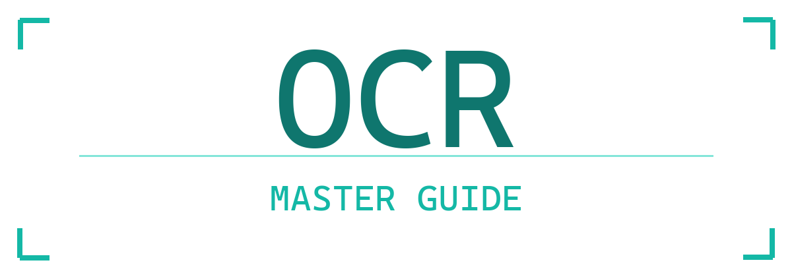
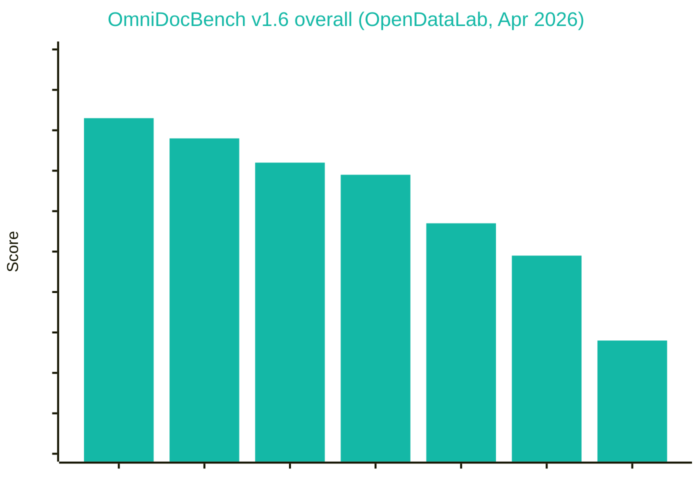
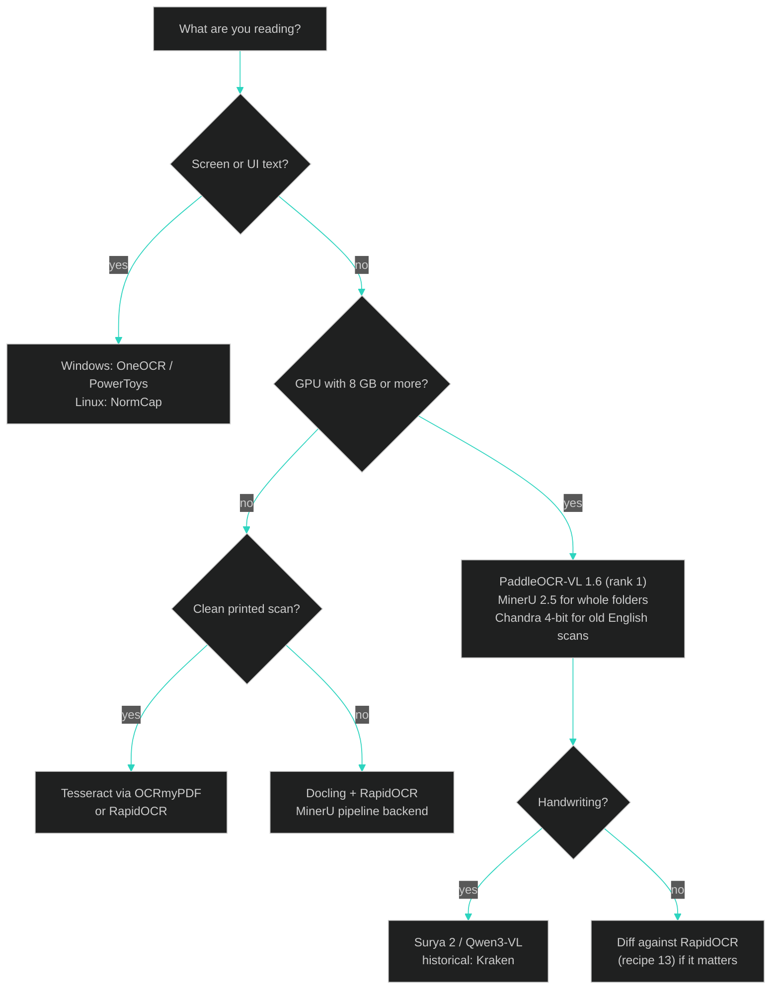

<div align="center">


[](https://git.io/typing-svg)

<br>

[](#-leaderboard---best-ocr-2026)
[](#-leaderboard---best-ocr-2026)
[](docs/02-engine-atlas.md)
[](#-docs)
[](#-install---best)

[](https://github.com/Ringmast4r/OCR-Master-Guide/stargazers)
[](https://github.com/Ringmast4r/OCR-Master-Guide/network/members)
[](#)
[](https://github.com/Ringmast4r/OCR-Master-Guide/commits/main)
[](#)



---

## `> what_is_this`

```bash
ringmast4r@github:~$ cat ocr-master-guide.txt

  PURPOSE:        Rank the best OCR tools of 2026 by the two public leaderboards, install them, measure them
  RANKED BY:      OmniDocBench (OpenDataLab, Shanghai AI Lab) + olmOCR-Bench (Ai2, Allen Institute for AI)
  WINNERS:        PaddleOCR-VL 1.6 (Baidu) | MinerU 2.5 (OpenDataLab) | GLM-OCR (Z.ai) | Chandra (Datalab)
  ALSO COVERED:   60+ engines, 100+ tools, classical to VLM, Windows 10/11 + Linux + WSL2 + CUDA
  HARDWARE:       Everything in the top tier under 4B params runs on an 8 GB consumer GPU
  STATUS:         [ ACTIVE ]
```

> **The answer to "which OCR is best" in 2026 is not Tesseract.** It is a small vision-language model that
> reads a whole page and writes Markdown. The two public leaderboards below agree on the top tier. This repo
> ranks them, tells you which ones fit your GPU, installs them with one script, and benchmarks them on your own
> pages so you can verify the ranking yourself.

</div>

---

## `> leaderboard --best-ocr-2026`

Two independent public benchmarks. Both are open source and rerunnable. Scores are from each project's README
on the date shown; they move every month, so click through before quoting.

### OmniDocBench v1.6 (OpenDataLab, Shanghai AI Laboratory) - updated 30 Apr 2026

1,651 PDF pages, 10 document types, English and Chinese. Scores text, formulas, tables, and reading order
as one end-to-end parse. [Leaderboard](https://github.com/opendatalab/OmniDocBench)

<div align="center">

| Rank | Model | Org | Params | Overall | Fits 8 GB GPU | Windows native | License |
|:----:|:------|:----|:------:|:-------:|:-------------:|:--------------:|:--------|
| 1 | [PaddleOCR-VL-1.6](https://github.com/PaddlePaddle/PaddleOCR) | Baidu | 0.9B | **96.3** | yes | yes | Apache-2.0 |
| 2 | [MinerU2.5-Pro](https://github.com/opendatalab/MinerU) | OpenDataLab | 1.2B | 95.8 | yes | yes (transformers backend) | AGPL-3.0 |
| 3 | [GLM-OCR](https://huggingface.co/zai-org) | Z.ai (Zhipu) | 0.9B | 95.2 | yes | yes (transformers) | MIT |
| 4 | PaddleOCR-VL-1.5 | Baidu | 0.9B | 94.9 | yes | yes | Apache-2.0 |
| 5 | PaddleOCR-VL | Baidu | 0.9B | 94.2 | yes | yes | Apache-2.0 |
| 6 | Youtu-Parsing | Tencent | 2.5B | 93.7 | yes | transformers | check card |
| 7 | Qianfan-OCR | Baidu | 4B | 93.9 | tight | transformers | check card |
| 8 | Ovis2.6-30B-A3B | AIDC | 30B MoE | 93.7 | no | no | Apache-2.0 |
| 9 | Logics-Parsing-v2 | Alibaba | 4B | 93.3 | tight | transformers | check card |
| 10 | ABot-OCR | Amap | 2B | 93.3 | yes | transformers | check card |
| 11 | FireRed-OCR | FireRed | 2B | 93.3 | yes | transformers | check card |
| 12 | [MinerU-2.5](https://github.com/opendatalab/MinerU) | OpenDataLab | 1.2B | 93.0 | yes | yes | AGPL-3.0 |
| 13 | Gemini 3 Pro | Google | API | 92.9 | cloud | cloud | commercial |
| 14 | Gemini 3 Flash | Google | API | 92.6 | cloud | cloud | commercial |
| 15 | [dots.ocr](https://github.com/rednote-hilab/dots.ocr) | RedNote | 3B | 90.8 | yes | transformers | MIT |

</div>

### olmOCR-Bench (Ai2, Allen Institute for AI)

1,400+ real PDFs, 7,000 unit tests (is this string present, is this table cell right, is the math correct).
Heavier on old scans, tiny text, and multi-column English. [Leaderboard](https://github.com/allenai/olmocr)

<div align="center">

| Rank | Model | Org | Params | Overall | Fits 8 GB GPU | Windows native | License |
|:----:|:------|:----|:------:|:-------:|:-------------:|:--------------:|:--------|
| 1 | [Chandra 0.1](https://github.com/datalab-to/chandra) | Datalab | 8B | **83.1** | 4-bit only | transformers | Apache-2.0 |
| 2 | Infinity-Parser 7B | Infinity | 7B | 82.5 | 4-bit only | transformers | check card |
| 3 | [olmOCR-2 (v0.4.0)](https://github.com/allenai/olmocr) | Ai2 | 7B | 82.4 | FP8 marginal | WSL2 only | Apache-2.0 |
| 4 | [PaddleOCR-VL](https://github.com/PaddlePaddle/PaddleOCR) | Baidu | 0.9B | 80.0 | yes | yes | Apache-2.0 |
| 5 | [Marker 1.10](https://github.com/datalab-to/marker) | Datalab | pipeline | 76.1 | yes | yes | GPL-3.0 |
| 6 | [DeepSeek-OCR](https://github.com/deepseek-ai/DeepSeek-OCR) | DeepSeek | 3B | 75.7 | yes | transformers | MIT |
| 7 | [MinerU 2.5.4](https://github.com/opendatalab/MinerU) | OpenDataLab | 1.2B | 75.2 | yes | yes | AGPL-3.0 |
| 8 | Mistral OCR API | Mistral | API | 72.0 | cloud | cloud | commercial |
| 9 | [Nanonets-OCR2-3B](https://huggingface.co/nanonets/Nanonets-OCR2-3B) | Nanonets | 3B | 69.5 | 4-bit | transformers | Apache-2.0 |

</div>

<div align="center">



</div>

### What the two boards agree on

- **PaddleOCR-VL** is the only model in the top tier of *both* boards that runs on an 8 GB card natively on Windows. It is the default "best OCR" pick in this repo.
- **Chandra, Infinity-Parser, and olmOCR-2** win olmOCR-Bench but are 7B to 8B models. You need 16 GB or a 4-bit build; Datalab and Ai2 also host them.
- **MinerU 2.5** is the best open pipeline you can run end to end on a PDF folder on CPU or GPU, and its Pro model is rank 2 on OmniDocBench.
- **GLM-OCR** is rank 3 at 0.9B under MIT, the most permissive license in the top three.
- **The best cloud API** is Gemini 3 Pro on OmniDocBench and Mistral OCR on olmOCR-Bench, and both trail the small open models.
- **Tesseract, EasyOCR, and every classical engine are absent** because these boards score Markdown structure, not plain text. On clean printed text they still work; on anything else they lost.

---

## `> install --best`

One script installs the ranked winners that fit an 8 GB GPU on Windows: PaddleOCR-VL 1.6, MinerU 2.5, Marker, Surya, Docling, DeepSeek-OCR-capable Transformers, plus RapidOCR and Tesseract wrappers for the CPU diff.

```powershell
git clone https://github.com/Ringmast4r/OCR-Master-Guide.git
cd OCR-Master-Guide
.\scripts\install-best.ps1                 # CUDA torch + PaddlePaddle GPU + PaddleOCR-VL + MinerU + Marker + Surya + Docling + RapidOCR
.\.venv\Scripts\Activate.ps1
paddleocr doc_parser -i samples\clean_300dpi.png --save_path out\    # rank 1 model, Markdown + JSON out
python scripts\ocr_bench.py samples\noisy_skewed.png --gt samples\ground_truth.txt   # every installed engine, CER + time
```

Linux: `bash scripts/install-linux.sh --gpu` then `pip install "paddleocr[doc-parser]" "mineru[core]" marker-pdf`. Servers (vLLM) and olmOCR's pipeline are Linux/WSL2 only; see [`docs/05`](docs/05-linux-stack.md).

Python, rank 1 model:

```python
from paddleocr import PaddleOCRVL
pipe = PaddleOCRVL()                         # downloads PaddleOCR-VL-1.6 on first run
for r in pipe.predict("page.png"):
    r.save_to_markdown("out/"); r.save_to_json("out/")
```

---

## `> tldr --pick-an-engine`

Best-first. The ranked winner is listed where it applies; the CPU fallback where you have no GPU.

| You have | Best (GPU) | CPU fallback | Why |
|:---------|:-----------|:-------------|:----|
| Any PDF or page image, want the best Markdown | **PaddleOCR-VL 1.6** | Docling + RapidOCR | Rank 1 OmniDocBench, 0.9B, Windows native |
| A folder of PDFs, end to end | **MinerU 2.5** (`-b vlm-transformers`) | MinerU `-b pipeline` | Rank 2 OmniDocBench, handles the whole folder, JSON + MD |
| English scans, old, multi-column, tiny text | **Chandra** (4-bit) or **olmOCR-2** (WSL2) | Marker | Top of olmOCR-Bench |
| Permissive license for a product | **GLM-OCR** (MIT) or **PaddleOCR-VL** (Apache) | RapidOCR (Apache) | Rank 3 and 1, no copyleft |
| Screenshots / UI text on Windows | OneOCR (Snipping Tool engine) | Windows.Media.Ocr, PowerToys | Built into the OS, instant |
| Clean printed scans to searchable PDF/A | PaddleOCR-VL for text, OCRmyPDF for the PDF layer | Tesseract via OCRmyPDF | OCRmyPDF is still the only tool that writes PDF/A |
| Phone photos, shadows, skew | PaddleOCR-VL or dots.ocr | RapidOCR + OpenCV | Trained on photos |
| Handwriting, modern | Surya 2, Qwen3-VL 8B (Ollama) | TrOCR line crops | VLMs read cursive |
| Handwriting, historical archives | Kraken + eScriptorium | PyLaia | Trainable on your material |
| Receipts, invoices, forms to fields | PaddleOCR-VL or Nanonets-OCR2 -> LLM | PP-StructureV3 | Structure, then extraction |
| Formulas | MinerU or PaddleOCR-VL (pages), pix2tex (crops) | UniMERNet | LaTeX out |
| CJK, Arabic, Indic | PaddleOCR-VL, dots.ocr (100 languages) | PaddleOCR, Tesseract script models | Trained multilingual |
| Thousands of pages, GPU | vLLM server + PaddleOCR-VL, or olmOCR pipeline | OCRmyPDF `--jobs`, RapidOCR pool | Batched inference |
| No install, pay per page | Gemini 3 Pro, Mistral OCR 3 | Azure Read | Cloud, still behind the open models |

Full recipes with code: [`docs/06-pairing-recipes.md`](docs/06-pairing-recipes.md).

---

## `> decide --flowchart`



---

## `> atlas --summary`

Every engine, not just the winners. Full atlas with install lines, licenses, and weak spots: [`docs/02-engine-atlas.md`](docs/02-engine-atlas.md).

<div align="center">

| Generation | Engines | Runs on | Character |
|:-----------|:--------|:--------|:----------|
| **5. VLM document parsers (the leaderboard)** | PaddleOCR-VL, MinerU 2.5, GLM-OCR, Chandra, olmOCR-2, DeepSeek-OCR-2, dots.ocr, HunyuanOCR, Nanonets-OCR2, LightOnOCR, Granite-Docling, Surya 2, Qwen3-VL | GPU (or slow CPU) | One model does layout + OCR + tables + formulas. Top accuracy. Can hallucinate |
| **4. Document parsers (pipelines)** | Marker, MinerU pipeline, Docling, olmOCR, Unstructured, OCRmyPDF | CPU or GPU | Layout + reading order + tables -> Markdown/JSON/PDF-A |
| **3. DL detector + recognizer** | PaddleOCR PP-OCRv5/v6, RapidOCR, EasyOCR, docTR, OnnxTR, MMOCR, OpenOCR | CPU or GPU | Boxes + strings. Robust to photos and rotation |
| **2. Classical line OCR** | Tesseract 5, Kraken, Calamari, OCRopus | CPU | LSTM+CTC on binarized lines. Fast, tiny, 100+ languages. Hates skew, photos, handwriting |
| **1. Handwriting / HTR** | TrOCR, PyLaia, Kraken, Transkribus, eScriptorium | CPU or GPU | Line-level, trainable on your own hand or archive |
| **0. OS-native** | Windows.Media.Ocr, OneOCR, PowerToys, Apple Vision | CPU/NPU | Zero install, great on screenshots |
| **Cloud** | Gemini 3, Mistral OCR 3, Azure Document Intelligence, Google Document AI, AWS Textract | API | Pay per page, prebuilt forms, behind the open models on both boards |

</div>

---

## `> stack --this-machine`

The box this guide was written on (Windows 10 Home 19045, RTX 3070 8 GB, September 2026), and what `install-best.ps1` put on it.

| Component | Found | After the script |
|:----------|:------|:-----------------|
| GPU | RTX 3070, 8 GB, driver 610.88 | PaddleOCR-VL 1.6, MinerU 2.5, Marker, Surya run on it; Chandra needs 4-bit |
| Python | `py -3.11` = 3.11.9 (default `python` is a 3.14 alpha with no wheels) | `.venv` built with 3.11 |
| Tesseract | 5.4.0 in Program Files, off PATH, English only | Kept as the CPU diff engine via pytesseract |
| OS-native | Windows.Media.Ocr present | `winocr` wrapper installed; OneOCR needs the Snipping Tool files ([docs/04](docs/04-windows-stack.md)) |

---

## `> docs`

| # | Guide | What it covers |
|:-:|:------|:---------------|
| 01 | [What OCR actually is](docs/01-what-is-ocr.md) | The pipeline, five generations of engines, CTC vs attention vs VLM, metrics, failure modes |
| 02 | [Engine atlas](docs/02-engine-atlas.md) | Every engine and tool: class, license, GPU, OS, best-for, weak spot, install line, link |
| 03 | [Tesseract deep dive](docs/03-tesseract-deep-dive.md) | Running the classical engine right: tessdata_best, PSM/OEM, config vars, output formats, fine-tuning |
| 04 | [Windows stack](docs/04-windows-stack.md) | UB Mannheim installer, Windows.Media.Ocr, OneOCR, PowerToys, CUDA on Windows, WSL2 |
| 05 | [Linux stack](docs/05-linux-stack.md) | apt/dnf/pacman, OCRmyPDF 17, NormCap, Paperless-ngx, vLLM servers, Docker, GPU |
| 06 | [Pairing recipes](docs/06-pairing-recipes.md) | 14 end-to-end pipelines by document type, ensemble voting, LLM post-correction |
| 07 | [VLM document parsers](docs/07-vlm-document-parsers.md) | Model cards for the leaderboard models, VRAM fit table for 8 GB, vLLM / Transformers / Ollama routes |
| 08 | [Preprocessing](docs/08-preprocessing.md) | DPI, deskew, binarization, denoise, borders, and when NOT to preprocess (VLMs) |
| 09 | [Evaluation](docs/09-evaluation.md) | CER/WER, jiwer, dinglehopper, both leaderboards explained, building your own ground truth |
| 10 | [Training and fine-tuning](docs/10-training-finetuning.md) | tesstrain, Kraken ketos, PaddleOCR, PyLaia, TrOCR, small-VLM LoRA |
| 11 | [Cloud APIs](docs/11-cloud-apis.md) | Gemini, Mistral OCR 3, Azure, Google, AWS, pricing per 1,000 pages |
| 12 | [Glossary](docs/12-glossary.md) | Every acronym in this repo, one line each |
| 13 | [Link index](docs/13-link-index.md) | Alphabetical master list of every project referenced, with URLs |

---

## `> tree`

```
OCR-Master-Guide/
|-- README.md                    this file
|-- OCR-Master-Guide.png         logo
|-- LICENSE                      MIT (scripts and text)
|-- docs/                        13 guides (see table above)
|-- scripts/
|   |-- install-best.ps1         Windows: CUDA torch + PaddlePaddle GPU + the ranked winners
|   |-- install-windows.ps1      Windows: Tesseract 5.5 + tessdata_best + venv + CPU stack
|   |-- install-linux.sh         Linux: apt/dnf/pacman + ocrmypdf + unpaper + venv + pip
|   |-- ocr_bench.py             run every installed engine on one image, compare CER + timing
|   |-- preprocess.py            OpenCV CLI for the classical engines: deskew, binarize, denoise, upscale
|   |-- tesseract_quickstart.py  finds tesseract.exe, runs a PSM sweep, dumps TSV confidences
|   |-- windows_native_ocr.py    Windows.Media.Ocr (winocr) and OneOCR from Python
|   |-- make_samples.py          regenerates samples/ and the logo with Pillow
|   |-- requirements.txt         CPU stack
|   `-- requirements-gpu.txt     GPU stack (after the CUDA torch wheel)
`-- samples/
    |-- clean_300dpi.png         printed text, 300 DPI equivalent
    |-- noisy_skewed.png         same text, 3 degree skew, noise, gray paper
    |-- screenshot_ui.png        small anti-aliased UI text
    |-- ground_truth.txt         transcript for clean + noisy
    `-- ground_truth_ui.txt      transcript for the screenshot
```

---

## `> pairing --philosophy`

1. **Preprocess for classical engines, not for VLMs.** Tesseract wants a deskewed, binarized 300 DPI line. PaddleOCR-VL wants the original color image.
2. **Text-native PDFs do not need OCR.** MinerU, Marker, and Docling check for a text layer first. Do the same.
3. **Two engines plus a diff beat one.** Run PaddleOCR-VL and RapidOCR, align outputs, review disagreements. Recipe 13. This is the cheapest hallucination check for a VLM.
4. **LLM post-correction is measured, not assumed.** It fixes obvious typos and invents plausible words in equal measure. CER before and after (recipe 12).
5. **A leaderboard is a prior, not a verdict.** Thirty lines of ground truth from your own documents through `ocr_bench.py` outranks both boards for your use.

---

## `> related_projects`

| Repo | What |
|:-----|:-----|
| [PaddlePaddle/PaddleOCR](https://github.com/PaddlePaddle/PaddleOCR) | Rank 1 on OmniDocBench (PaddleOCR-VL 1.6) |
| [opendatalab/MinerU](https://github.com/opendatalab/MinerU) | Rank 2 on OmniDocBench, best open end-to-end PDF pipeline |
| [datalab-to/chandra](https://github.com/datalab-to/chandra) | Rank 1 on olmOCR-Bench |
| [allenai/olmocr](https://github.com/allenai/olmocr) | olmOCR-2 and the olmOCR-Bench itself |
| [opendatalab/OmniDocBench](https://github.com/opendatalab/OmniDocBench) | The OmniDocBench leaderboard |
| [datalab-to/marker](https://github.com/datalab-to/marker) | The everyday PDF-to-Markdown pipeline |
| [tesseract-ocr/tesseract](https://github.com/tesseract-ocr/tesseract) | The classical engine, still the PDF/A workhorse via OCRmyPDF |
| [Ringmast4r/pdf-archive](https://github.com/Ringmast4r/pdf-archive) | The PDFs this guide gets pointed at |

**Maintained by** [@Ringmast4r](https://github.com/Ringmast4r)

<div align="center">


</div>
