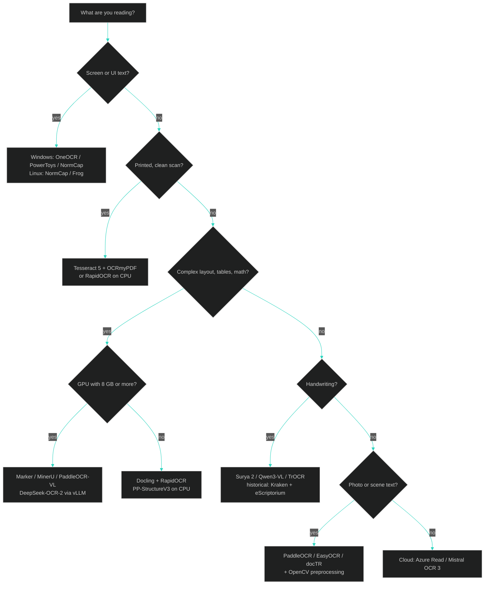
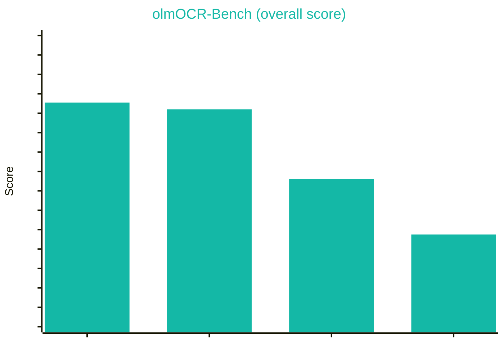

<div align="center">


[](https://git.io/typing-svg)

<br>

[](docs/02-engine-atlas.md)
[](#-docs)
[](docs/06-pairing-recipes.md)
[](docs/04-windows-stack.md)
[](scripts/)

[](https://github.com/Ringmast4r/OCR-Master-Guide/stargazers)
[](https://github.com/Ringmast4r/OCR-Master-Guide/network/members)
[](#)
[](https://github.com/Ringmast4r/OCR-Master-Guide/commits/main)
[](#)


---

## `> what_is_this`

```bash
ringmast4r@github:~$ cat ocr-master-guide.txt

  PURPOSE:        One place that explains every serious OCR engine and how to pair them
  SCOPE:          Classical (Tesseract) -> DL pipelines (PaddleOCR) -> VLM parsers (olmOCR)
  PLATFORMS:      Windows 10/11 native, Linux native, WSL2, Docker, CUDA
  COVERAGE:       60+ engines, 100+ tools, 14 pairing recipes, 13 guides, 6 scripts
  METHOD:         Deep research (Sep 2026) + fast tutorials + runnable bench script
  AUDIENCE:       Someone already running Tesseract who wants to know what else exists

  STATUS:         [ ACTIVE ]
```

> **OCR** turns pixels into text. In 2026 that is no longer one program. It is a stack:
> preprocessing, layout analysis, text detection, recognition, post-correction, and output format.
> Every layer has three or four good open-source options. This repo maps all of them and tells you
> which ones fit together.

</div>

---

## `> tldr --pick-an-engine`

If you only read one table, read this one.

| You have | Use this first | Then pair with | Why |
|:---------|:---------------|:---------------|:----|
| Clean printed scans, CPU only | **Tesseract 5.5** via **OCRmyPDF** | `unpaper` / `--deskew --clean` | Fastest install, searchable PDF/A out, 100+ languages |
| Printed scans, want better accuracy on CPU | **RapidOCR** (PP-OCRv5/v6 on ONNX) | OpenCV preprocessing | Beats Tesseract on photos and mixed fonts, 15 MB, no PyTorch |
| Screenshots / UI text on Windows | **OneOCR** (Snipping Tool engine) or **Windows.Media.Ocr** | PowerToys Text Extractor for hotkey use | Built into the OS, instant, surprisingly accurate on rendered text |
| Screenshots on Linux | **NormCap** | Tesseract (bundled) | Select region, text lands in clipboard |
| PDFs with tables, columns, math -> Markdown for an LLM | **Marker** (Surya) or **MinerU** or **Docling** | LLM post-correction | Layout aware, outputs Markdown/JSON, batch friendly |
| Same, best possible accuracy, you have a GPU | **PaddleOCR-VL 1.6** / **DeepSeek-OCR-2** / **Chandra** via vLLM | OmniDocBench to verify | Top of the 2026 leaderboards, sub-4B models fit an 8 GB card |
| Handwriting (modern) | **Surya 2** or **Qwen3-VL 8B** (Ollama) | TrOCR for line crops | VLMs read cursive that Tesseract cannot |
| Handwriting (historical, archival) | **Kraken** + **eScriptorium** or **Transkribus** | PyLaia for training | Built by the digital-humanities world for exactly this |
| Receipts, invoices, forms (key-value extraction) | **PaddleOCR PP-StructureV3** or **Azure Document Intelligence** | LLM for field mapping | Structure, not just text |
| Formulas | **pix2tex** / **Texify** (crops), **UniMERNet**, **Nougat** or **Marker** (pages) | Marker `--use_llm` | Outputs LaTeX |
| CJK, Arabic, Indic, mixed scripts | **PaddleOCR** (CJK), **Tesseract script models**, **Kraken** (Arabic) | YomiToku (Japanese), manga-ocr | Script-specific models win |
| Thousands of pages, no GPU | **OCRmyPDF --jobs N** or **RapidOCR** in a pool | Paperless-ngx for storage | Throughput per dollar |
| Thousands of pages, GPU | **olmOCR** pipeline or **vLLM** server + PaddleOCR-VL | olmOCR-Bench | Built for trillion-token PDF linearization |
| No install at all, pay per page | **Mistral OCR 3** or **Azure Read** | Your own CER check | About $1.50 to $2 per 1,000 pages |

Full reasoning per row: [`docs/06-pairing-recipes.md`](docs/06-pairing-recipes.md).

---

## `> decide --flowchart`



---

## `> stack --this-machine`

Audit of the box this guide was written on (Windows 10 Home 19045, September 2026). Use it as a template for your own audit.

| Component | Found | Verdict |
|:----------|:------|:--------|
| Tesseract | `v5.4.0.20240606` at `C:\Program Files\Tesseract-OCR`, **not on PATH**, languages `eng` + `osd` only | Upgrade to 5.5.3 (UB Mannheim), add to PATH, install `tessdata_best` `eng` and `script/Latin` |
| Python | `py -3.11` = 3.11.9 (use this). Default `python` = 3.14.0a7 (avoid, no wheels) | Every venv in this repo is built with `py -3.11 -m venv` |
| Python OCR libs | `opencv-python 4.11`, `pillow 12.2`, `numpy 1.26`; no pytesseract, paddle, rapidocr, easyocr, torch | `scripts/install-windows.ps1` fills the gap |
| GPU | NVIDIA GeForce RTX 3070, 8 GB, driver 610.88, no `nvcc` | Fine. PyTorch/ONNX wheels bundle CUDA runtime. 8 GB fits every sub-4B VLM in [`docs/07`](docs/07-vlm-document-parsers.md) |
| PDF helpers | No `ocrmypdf`, `magick`, `gs`, `pdftoppm`, `qpdf`, `unpaper` on PATH | Install via the script or use WSL2 for the Linux-only ones (`unpaper`) |
| OS-native OCR | Windows 10 ships `Windows.Media.Ocr`; OneOCR needs the Windows 11 Snipping Tool files | See [`docs/04`](docs/04-windows-stack.md) for both |

---

## `> quickstart`

### Windows (PowerShell, 5 minutes)

```powershell
git clone https://github.com/Ringmast4r/OCR-Master-Guide.git
cd OCR-Master-Guide
.\scripts\install-windows.ps1          # Tesseract 5.5 via winget, tessdata_best, venv, pip deps
.\.venv\Scripts\Activate.ps1
python scripts\ocr_bench.py samples\clean_300dpi.png --gt samples\ground_truth.txt
```

### Linux (Debian/Ubuntu/Fedora/Arch, 5 minutes)

```bash
git clone https://github.com/Ringmast4r/OCR-Master-Guide.git
cd OCR-Master-Guide
bash scripts/install-linux.sh          # tesseract + ocrmypdf + unpaper + venv + pip deps
source .venv/bin/activate
python scripts/ocr_bench.py samples/noisy_skewed.png --gt samples/ground_truth.txt
```

`ocr_bench.py` runs **every engine it can import** (Tesseract, RapidOCR, EasyOCR, PaddleOCR, docTR, Surya, Windows OCR, OneOCR) on one image and prints time, characters, and CER against the ground truth. Install more engines, rerun, watch the table grow.

---

## `> atlas --summary`

The full atlas with install lines, licenses, and weak spots is [`docs/02-engine-atlas.md`](docs/02-engine-atlas.md). The short version:

<div align="center">

| Generation | Engines | Runs on | Character |
|:-----------|:--------|:--------|:----------|
| **1. Classical line OCR** | Tesseract 5, Kraken, Calamari, OCRopus, Ocrad, GOCR | CPU | LSTM+CTC on binarized lines. Fast, tiny, deterministic, 100+ languages. Hates skew, noise, photos, handwriting |
| **2. DL detector + recognizer** | PaddleOCR PP-OCRv5/v6, RapidOCR, EasyOCR, docTR, OnnxTR, MMOCR, OpenOCR, ocrs | CPU or GPU | DBNet/CRAFT detection + CRNN/SVTR recognition. Robust to photos, rotation, mixed fonts. Word-level boxes |
| **3. Document parsers** | Marker, MinerU, Docling, olmOCR, Unstructured, Nougat, OCRmyPDF | CPU or GPU | Layout + reading order + tables + math -> Markdown/JSON/PDF-A. What you feed an LLM |
| **4. VLM OCR models** | PaddleOCR-VL, DeepSeek-OCR-2, GLM-OCR, dots.ocr, HunyuanOCR, Chandra, olmOCR-2, Nanonets-OCR2, LightOnOCR, Granite-Docling, Surya 2, Qwen3-VL | GPU (or slow CPU) | One model does layout + OCR + tables + formulas. Top accuracy. Can hallucinate. Needs vLLM/Transformers/Ollama |
| **5. Handwriting / HTR** | TrOCR, PyLaia, Kraken, Transkribus, eScriptorium, OCR4all, Loghi | CPU or GPU | Line-level transcription, trainable on your own hand or archive |
| **6. OS-native** | Windows.Media.Ocr, OneOCR, PowerToys, Apple Vision | CPU/NPU | Zero install. Great on rendered text, screenshots, UI |
| **7. Cloud** | Azure Document Intelligence, Google Document AI, AWS Textract, Mistral OCR 3 | API | Pay per page, no ops, strong on forms |

</div>

---

## `> benchmarks --olmocr-bench`

olmOCR-Bench scores published in the [allenai/olmocr](https://github.com/allenai/olmocr) README (higher is better, October 2025 snapshot). Details, caveats, and OmniDocBench in [`docs/09-evaluation.md`](docs/09-evaluation.md).

<div align="center">



</div>

Do not treat any single leaderboard as truth. Classical engines like Tesseract are not on it at all because the benchmark is about full-document Markdown, not raw text. On clean printed text a tuned Tesseract or docTR still ties the VLMs on character error rate.

---

## `> docs`

| # | Guide | What it covers |
|:-:|:------|:---------------|
| 01 | [What OCR actually is](docs/01-what-is-ocr.md) | The pipeline, five generations of engines, CTC vs attention vs VLM, metrics, failure modes |
| 02 | [Engine atlas](docs/02-engine-atlas.md) | Every engine and tool: class, license, GPU, OS, best-for, weak spot, install line, link |
| 03 | [Tesseract deep dive](docs/03-tesseract-deep-dive.md) | Versions, tessdata_best vs fast, PSM/OEM, config vars, output formats, wrappers, fine-tuning |
| 04 | [Windows stack](docs/04-windows-stack.md) | UB Mannheim installer, PATH, Windows.Media.Ocr, OneOCR, PowerToys, CUDA on Windows, WSL2 |
| 05 | [Linux stack](docs/05-linux-stack.md) | apt/dnf/pacman, OCRmyPDF 17, NormCap, gImageReader, Paperless-ngx, Docker, GPU |
| 06 | [Pairing recipes](docs/06-pairing-recipes.md) | 14 end-to-end pipelines by document type, ensemble voting, LLM post-correction |
| 07 | [VLM document parsers](docs/07-vlm-document-parsers.md) | Model cards, VRAM table for an 8 GB card, vLLM / Transformers / Ollama routes, hallucination control |
| 08 | [Preprocessing](docs/08-preprocessing.md) | DPI, deskew, binarization (Otsu/Sauvola/adaptive), denoise, borders, when NOT to preprocess |
| 09 | [Evaluation](docs/09-evaluation.md) | CER/WER, jiwer, dinglehopper, olmOCR-Bench, OmniDocBench, building ground truth |
| 10 | [Training and fine-tuning](docs/10-training-finetuning.md) | tesstrain, Kraken ketos, PaddleOCR, PyLaia, TrOCR, synthetic data |
| 11 | [Cloud APIs](docs/11-cloud-apis.md) | Azure, Google, AWS, Mistral OCR 3, pricing per 1,000 pages, when cloud wins |
| 12 | [Glossary](docs/12-glossary.md) | Every acronym in this repo, one line each |
| 13 | [Link index](docs/13-link-index.md) | Alphabetical master list of every project referenced, with URLs |

---

## `> tree`

```
OCR-Master-Guide/
|-- README.md                    this file
|-- OCR-Master-Guide.png         logo
|-- LICENSE                      MIT (scripts and text)
|-- docs/                        13 guides (see table above)
|-- scripts/
|   |-- ocr_bench.py             run every installed engine on one image, compare CER + timing
|   |-- preprocess.py            OpenCV CLI: deskew, binarize, denoise, upscale, border trim
|   |-- tesseract_quickstart.py  finds tesseract.exe, runs PSM sweep, dumps TSV confidences
|   |-- windows_native_ocr.py    Windows.Media.Ocr (winocr) and OneOCR from Python
|   |-- make_samples.py          regenerates samples/ and the logo with Pillow
|   |-- install-windows.ps1      winget Tesseract 5.5 + tessdata_best + venv + pip
|   |-- install-linux.sh         apt/dnf/pacman + ocrmypdf + unpaper + venv + pip
|   |-- requirements.txt         CPU stack (tesseract, rapidocr, doctr, ocrmypdf, jiwer, opencv)
|   `-- requirements-gpu.txt     adds torch CUDA, easyocr, paddleocr, surya, marker, docling
`-- samples/
    |-- clean_300dpi.png         printed text, 300 DPI equivalent
    |-- noisy_skewed.png         same text, 3 degree skew, noise, gray paper
    |-- screenshot_ui.png        small anti-aliased UI text (the case Tesseract fails)
    `-- ground_truth.txt         exact transcript for CER scoring
```

---

## `> pairing --philosophy`

1. **Preprocess for classical engines, not for VLMs.** Tesseract wants a deskewed, binarized 300 DPI line. PaddleOCR-VL wants the original color image. Feeding a binarized image to a VLM makes it worse.
2. **Detection and recognition are separable.** You can run PaddleOCR's DBNet detector, crop lines, and hand them to TrOCR or Tesseract. Every pipeline library exposes this.
3. **Text-native PDFs do not need OCR.** Check with PyMuPDF first. Only rasterize pages that have no text layer (`ocrmypdf --skip-text` does this for you).
4. **Two engines plus a diff beat one engine.** Run Tesseract and RapidOCR, align outputs, flag disagreements for review. Recipe 13.
5. **LLM post-correction is not free.** It fixes obvious typos and invents plausible words in equal measure. Measure CER before and after (recipe 12, ICDAR 2026 HIPE-OCRepair findings).
6. **Measure.** A ground-truth file of 30 lines you typed yourself is worth more than any leaderboard.

---

## `> related_projects`

| Repo | What |
|:-----|:-----|
| [Ringmast4r/pdf-archive](https://github.com/Ringmast4r/pdf-archive) | The PDFs this guide gets pointed at |
| [Ringmast4r/OUI-Master-Database](https://github.com/Ringmast4r/OUI-Master-Database) | Same "merge every source" doctrine, applied to MAC vendors |
| [tesseract-ocr/tesseract](https://github.com/tesseract-ocr/tesseract) | The engine you already run |
| [PaddlePaddle/PaddleOCR](https://github.com/PaddlePaddle/PaddleOCR) | The engine you should try next |
| [datalab-to/marker](https://github.com/datalab-to/marker) | PDF -> Markdown, the everyday workhorse |
| [allenai/olmocr](https://github.com/allenai/olmocr) | Batch VLM OCR at scale, plus olmOCR-Bench |
| [opendatalab/OmniDocBench](https://github.com/opendatalab/OmniDocBench) | The document-parsing leaderboard everyone quotes |

**Maintained by** [@Ringmast4r](https://github.com/Ringmast4r)

<div align="center">


</div>
